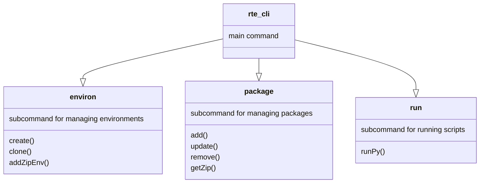

<h1 align="center">
rte-cli Command Line Tool
</h1>

<p align="center">

</p>

rte-cli is a utility for handling python runtime environment in containers for tazi. It has features to manage conda environments, python packages etc.

**<u>Environments</u>**:
 It enables you to **create** a conda environment, **clone** it and **add**/**remove** packages to/from specified environment.
**<u>Packages</u>**:
It enables you to **install, remove, update** a package or **export environment packages** and **install for offline use**.


You can customize environment or package using a command line flag.

_Note: No matter in which container you install the package, all environments are shared between containers using mounting a volume binding._
<br>

#### Version 2.0
- More verbose errors
- More reliable subcommands
- Container home path(WORKDIR) is now customizable; not fixed to "/home/tazi".
- Volume binding path is now customizable, not fixed to "/tmp/envs/"
- You can now download python packages to your local environment. Then you can use them in an offline environment with rte-cli.(Only for macOs and Linux users)


Usage:
  ```rte-cli [command]```

Available Commands:
> **completion**  Generate the autocompletion script for the specified shell

> **environ**     Manage conda environments

> **help**        Help about any command

> **package**    Manage python packages


Flags:
>-h, --help                 help for rte-cli

>-c, --container *string*           *container name*

>-e, --envName *string*             *conda environment name, default: base*

>-n, --newEnvName *string*          *environment name for cloning a new environment*

>-p, --packageName *string*         *package name*

>-f, --sourceFile *string*          *path of compressed package directory*

>- , --version                      *version for rte-cli*

>-r, --requirementsFile *string*    *Path of requirements.txt to be installed*

>-v , --pythonVersion *string*      *Python version of the environment*

>-b , --hostBindPath *string*       *home path for container, default: /home/tazi*

>-d , --destination *string*        *to where to save the exported packages*

>-l , --local *string*              *from where to get packages and zip. true means from local, false means from a container.*

Use **"rte-cli [command] --help"** for more information about a command.

### Example Usage ####
#### Environment Related ####
 - **To create an environment in a container:**
Environment name: my_env
Container name: my_cont
Python version: 3.8.5

```rte-cli environ create -c my_cont -e my_env -v 3.8.5 ```

 - **To clone an environment in a container:**
Environment name: my_env
Container name: my_cont
Clone environment name: my_clone_env

```rte-cli environ clone --container my_cont --envName my_env --newEnvName my_clone_env```

 - **To copy zipped environment in a container:**
Environment name: my_env
Container name: my_cont
Zipped environment file: zipped_env.zip

```rte-cli environ AddZipEnv --container my_cont --envName my_env --sourceFile zipped_env.zip```

#### Package Related ####
 - **To add a package to the environment in the container**
Environment name: my_env
Container name: my_cont
Clone environment name: numpy
Home path of the container: /home/tazi
``` rte-cli package add -c my_cont -e my_env -p numpy -m /home/tazi```

 - **To remove a package from the environment in the container**
Environment name: my_env
Container name: my_cont
Clone environment name: numpy
Home path of the container: /home/tazi
``` rte-cli package remove -c my_cont -e my_env -p numpy -m /home/tazi```

 - **To update a package of the environment in the container**
Environment name: my_env
Container name: my_cont
Clone environment name: numpy
Home path of the container: /home/tazi
``` rte-cli package update -c my_cont -e my_env -p numpy -m /home/tazi```

 - **To install packages from a compressed file**
Environment name: my_env
Container name: my_cont
Home path of the container: /home/tazi
Source file: downloads/numpy.zip

``` rte-cli package addZip -c my_cont -e my_env -m /home/tazi -f downloads/numpy.zip```

 - **To install multiple packages from a requirements.txt file**
Environment name: my_env
Container name: my_cont
Source file: downloads/requirements.txt
Home path of the container: /home/tazi

``` rte-cli package installReq -c my_cont -e my_env -r downloads/requirements.txt -m /home/tazi```

 - **To wrap packages of an environment to a compressed file**
Environment name: my_env
Container name: my_cont
Home path of the container: /home/tazi
From local environment or container(boolean value): local

``` rte-cli package getZip -c my_cont -e my_env -m /home/tazi -l=true -f downloads/numpy.zip```
#### Run Related ####
 - **To run a python script**
Environment name: my_env
Container name: my_cont
Script name: script.py
``` rte-cli run -c my_cont -e my_env -p script.py```